# 有道词典笔 获取 ADB 权限

> 原作者：听秋念
> 原文：https://m.bilibili.com/opus/1041644000127221764

> 86lbs: 搬运并修改

---

## 操作难度说明

本教程综合难度**较高**，涉及以下技术环节，建议在动手前评估自己的接受能力：

- 网络抓包（Wireshark）
- HTTP 接口手动调试
- 十六进制编辑器操作（WinHex）
- 哈希值计算与替换
- 本地服务器搭建（Node.js + Python）
- hosts 文件劫持 DNS

**整个流程没有一键脚本，每一步都需要手动完成，且不同设备/固件版本的细节可能有差异。**

### 🤖 遇到问题？可以寻求 AI 帮助

本教程的每张图片下方都附有折叠的文字版操作说明，专为方便 AI 阅读和理解而设计。如果你在某个步骤卡住了，可以将这份 README 文件发给 AI（如 Claude、deepseek 等），描述你卡在哪里，让 AI 结合教程内容给你具体指导。

📄 **README 文件下载地址：**
`https://raw.githubusercontent.com/86lbs/ydpen-adb-unlock/main/README.md`

---

## 前言

有道词典笔早期好像使用的是安卓系统（？），但后面出的笔都不是安卓系统，而是基于 Linux 的词典笔 OS，故即使开启有道词典笔的 ADB 依然无法实现安装 APK 等功能，仅限折腾着玩玩罢了。

> ⚠️ **操作有风险，玩机需谨慎。** 因任何操作造成的包括但不限于变砖、炸 app 等损失，作者均不承担任何责任，也没有义务帮你修复。如有侵权联系删除。

有道词典笔一直都带有 ADB 开启入口，只需多次点击"法律监管"中的文本即可打开。

但 ADB 打开并不意味着结束，当你尝试使用 ADB 连接设备时，会弹出：

```
login with "adb shell auth" to continue.
```

按照提示输入 `adb shell auth` 则会出现一个输入密码的提示：

```
YoudaoDictionaryPen-xxx's password:
```

在早期的系统版本中，这个密码被设置为 `CherryYoudao`，但当词典笔 OS 出现后，ADB 密码开始使用 MD5 储存，导致你无法通过解包固件获得明文。

本文采用大佬 SkySight-666 的方案加以改进，靠**中间人攻击劫持更新请求**从而替换更新包。

**参考链接：**
- https://github.com/orgs/PenUniverse/discussions/250
- https://github.com/orgs/PenUniverse/discussions/277

**本文用到的全部工具：** https://www.123684.com/s/sE1hjv-mklwd?提取码: `0m8B`

---

## 正文

### 第一步：抓包，获取系统全量包链接

使用词典笔连接电脑热点，启用 Wireshark 对热点所在连接进行抓包，词典笔检查更新，在 Wireshark 中找到如图 POST 请求，抓到后可以停止抓包。

> 💡 **抓不到包？** 词典笔界面显示"正在检查更新"并不代表它真的发出了请求，有时实际上什么都没发——此时 Wireshark 里不会有任何收获。解决方法是**恢复出厂设置后重试**。
>
> ⚠️ **重置后无法检查更新！** 词典笔恢复出厂设置后，"检查更新"功能会失效。需要先正常使用词典笔联网，向官方服务器完成注册/激活后，检查更新功能才会恢复正常，届时再进行抓包。

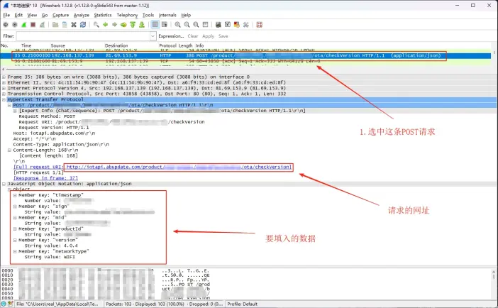

<details>
<summary>📋 操作说明（文字版）</summary>

将词典笔连接到电脑共享的 Wi-Fi 热点，打开 Wireshark 并选择热点对应的网络接口开始抓包。在词典笔上触发"检查更新"，观察 Wireshark 是否捕获到发往 `iotapi.abupdate.com` 的 HTTP POST 请求。找到该请求后停止抓包，在请求详情中记录以下字段：`timestamp`、`sign`、`mid`、`productId`，以及完整的请求 URL（即 `/product/.../ota/checkVersion` 那一段）。

</details>

### 第二步：重新发送更新请求，获取全量包链接

找一个 HTTP 测试网站（这里用的是 SOJSON），将 Header 设置好，将你在 Wireshark 获得的数据填入，发送如下请求：

```json
{
   "timestamp": "这里填你 WireShark 获得的 timestamp",
   "sign": "这里填你 WireShark 获得的 sign",
   "mid": "这里填你 WireShark 获得的 mid",
   "productId": "这里填你 WireShark 获得的 productID",
   "version": "99.99.90",
   "networkType": "WIFI"
}
```

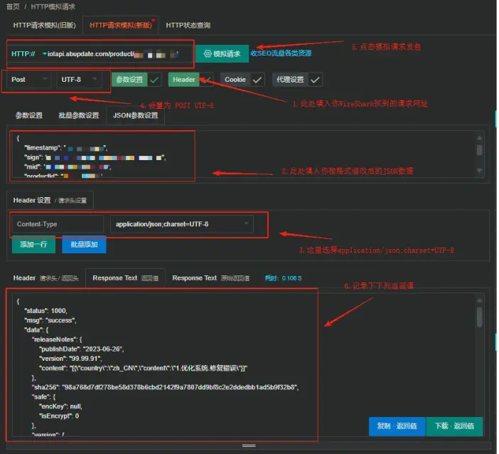

<details>
<summary>📋 操作说明（文字版）</summary>

打开 SOJSON 或其他 HTTP 测试工具，将请求方式设为 POST，URL 填入 Wireshark 抓到的完整请求地址（`https://iotapi.abupdate.com/product/.../ota/checkVersion`）。Header 中添加 `Content-Type: application/json;charset=UTF-8`。请求体填入上方 JSON，其中 `version` 填 `99.99.90`（触发服务器返回最新包），其余字段全部来自 Wireshark 抓包结果。发送后，从返回的 JSON 中找到 `data.version.deltaUrl` 字段，这就是固件完整包的下载地址。同时记录 `segmentMd5` 中每一个分片的 `endpos` 值，后续计算校验码时需要用到。

</details>

请求完毕我们会获得一个包含完整包链接的 JSON，示例如下：

```json
{
   "status": 1000,
   "msg": "success",
   "data": {
      "releaseNotes": {
            "publishDate": "2023-06-26",
            "version": "99.99.91",
            "content": "[{\"country\":\"zh_CN\",\"content\":\"1.优化系统.修复错误\"}]"
      },
      "safe": {
            "encKey": null,
            "isEncrypt": 0
      },
      "version": {
            "bakUrl": "http://iotdownbak.mayitek.com/xxxxxxxxxx/xxxxxxx/5383b000-49c2-4d29-812e-42c52b075599.img",
            "deltaUrl": "http://iotdown.mayitek.com/xxxxxxxxxx/xxxxxxx/5383b000-49c2-4d29-812e-42c52b075599.img",
            "fileSize": 1397088268,
            "md5sum": "5c668394fa2779eada86601292ff877b",
            "sha": "6fdd26798679e5cb1e877051c7970a89307e303"
      }
   }
}
```

> ⚠️ **特别注意：** 这不是所有型号通用的！你要自己抓自己对应的更新包。

取出其中 `deltaUrl` 的值，下载更新包，然后使用 **RKDevTool → 高级功能**，选择固件后点击解包。

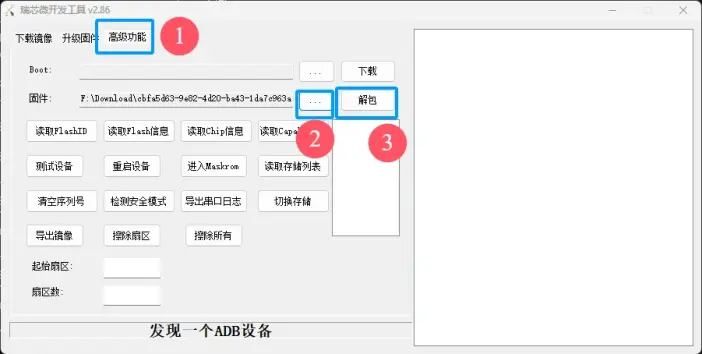

<details>
<summary>📋 操作说明（文字版）</summary>

下载 `deltaUrl` 指向的完整固件包（.img 文件）。打开 RKDevTool v2.86，切换到"高级功能"选项卡，在"固件"一栏点击 `...` 选择刚下载的 img 文件，然后点击"解包"按钮。解包完成后，在工具同目录下的 `Output` 文件夹中找到解出的分区文件。对于 x7pro，进入 `Android` 子目录，找到 `rootfs` 分区文件，使用 DNA 等 ROM 工具进一步解包 rootfs，最终在 `/usr/bin/` 目录下找到 `adbd_auth.sh`。

如果不想完整解包，可以直接用 WinHex 打开 img，搜索文本 `adbd_auth.sh`、`adb_auth.sh` 或 `/tmp/.adb_auth_verified`，在搜索结果的前后上下文中直接阅读鉴权逻辑，找到哈希算法与哈希值即可，无需解包任何分区。

</details>

> pipicat613 反馈：RKDevTool 最好用 v2.86 的，旧版本的解包会失败！

### 第三步：定位 ADB 鉴权脚本，查找校验方式

#### 方法一：直接在 img 中 Hex 搜索（推荐）

**不需要完整解包 rootfs**，可以直接用 WinHex 打开完整固件 img，搜索以下任意一个关键字符串，定位到鉴权脚本在 img 中的位置：

- `adbd_auth.sh`
- `adb_auth.sh`
- `/tmp/.adb_auth_verified`

找到后，查看该字符串前后的上下文内容，鉴权逻辑（包括使用的哈希算法、哈希值、`echo` 是否带 `-n` 等）通常就在附近几百字节内，可以直接阅读并记录哈希值，无需解包。

#### 方法二：完整解包后查看脚本

如需完整查看脚本内容，在 Output 文件夹中可以看到解好的包。对于 x7pro 来说，需要进入 Android 文件夹并分解 rootfs 分区，最终在 `/usr/bin` 下找到 `adbd_auth.sh`，打开它：

```sh
#!/bin/sh
VERIFIED=/tmp/.adb_auth_verified
if [ -f "$VERIFIED" ]; then
    echo "success."
    exit
fi
for i in $(seq 1 3); do
    read -p "$(hostname -s)'s password: " PASSWD
    if [ "$(echo $PASSWD | md5sum)" = "302af1d80be1106586775350cc0a2c92  -" ]; then
        echo "success."
        touch $VERIFIED
        exit
    fi
    echo "password incorrect!"
done
false
```

找到其中的哈希值，**记录下来备用**。

> ⚠️ **注意：不同固件版本的校验方式不同！** 脚本中的校验算法并非一律是 MD5，也可能是 SHA256 或其他方式，且换行符的位置也因版本而异。**务必仔细阅读你自己解出的 `adbd_auth.sh` 脚本内容**，搞清楚以下三点再操作：
>
> 1. **校验算法**：是 `md5sum`、`sha256sum` 还是其他？
> 2. **换行符位置**：`echo $PASSWD` 会在末尾附加换行符，但部分版本可能使用 `echo -n`（不附加换行符），或在其他位置处理；
> 3. **比对格式**：注意比对字符串的完整格式，例如 `md5sum` 输出带有尾随空格和 `-`（如 `abc123  -`），这些都是校验的一部分。
>
> 总结：**以脚本实际内容为准，不要套用其他人的结论。**

### 第四步：使用 WinHex 替换哈希值

打开 WinHex 并打开你的完整包 img，开启搜索，搜索前面记录的哈希值。

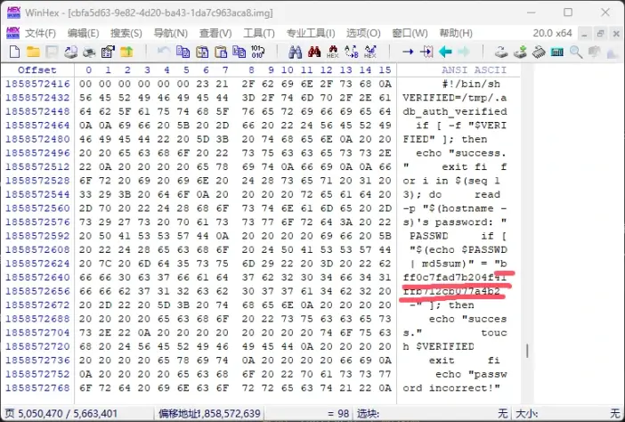

<details>
<summary>📋 操作说明（文字版）</summary>

打开 WinHex，通过"文件 → 打开"载入完整固件 img（文件较大，WinHex 会以只读映射方式打开）。使用"搜索 → 查找文本"或"查找十六进制"功能，将从 `adbd_auth.sh` 中记录的哈希字符串（如 `302af1d80be1106586775350cc0a2c92  -`，注意包含末尾的两个空格和 `-`）作为搜索内容，定位到 img 中对应的位置。找到后，将该哈希字符串原地替换为你自己密码（含换行符）计算出的哈希值，**字符数必须与原字符串完全相同，不能多也不能少**。保存文件，确认文件大小没有发生任何变化。

</details>

> ⚠️ **换行符陷阱！** 脚本中用的 `echo $PASSWD` 会在密码末尾**自动附加一个换行符**再计算哈希，因此你在计算自己密码的哈希时，也必须带上换行符，否则哈希对不上，永远提示密码错误。这是大部分人升级成功却依旧无法通过验证的主要原因。
>
> 计算方法：询问 GPT"把 `你的密码` 加一个 `\n` 换行符转为 md5（或 sha256）"即可得到正确结果：

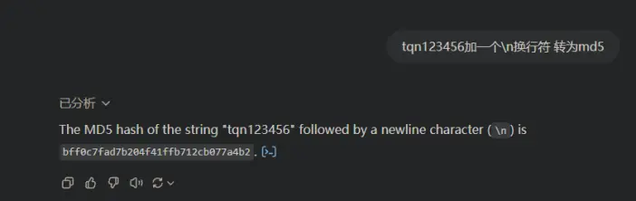

<details>
<summary>📋 操作说明（文字版）</summary>

由于鉴权脚本使用 `echo $PASSWD | md5sum` 计算哈希，`echo` 会在密码末尾自动附加一个换行符 `\n`，因此你需要计算的不是密码本身的哈希，而是"密码 + `\n`"整体的哈希。例如密码为 `tqn123456`，实际参与哈希计算的是 `tqn123456\n`。可以直接询问 AI："把字符串 `tqn123456` 加上一个换行符后计算 MD5 是多少？"，得到的结果才是应该写入 img 的哈希值。如果你的固件使用 SHA256，则同理换成 SHA256 计算。

</details>

总之，把带换行符一起计算出的哈希值用来替换原 img 中的哈希值，然后保存文件。

> ✅ 注意：此时文件大小未发生改变，大小一个字节也没变！

### 第五步：计算修改后文件的校验码

编辑 `getnewmd5.py`，使 `segment_sizes` 数组中的值为前面抓包抓到的每一个 `endpos` 的值（有多少就加多少，每个机器值可能不一样多）：

> 💡 **下载进度卡住不动？** 词典笔在下载固件时会对每个分片进行 MD5 校验，校验失败会反复重试，表现为进度条卡死在某个位置。如果出现这种情况，几乎可以确定是 `segmentMd5` 中某个分片的 MD5 计算有误——最常见的原因是 `segment_sizes`（即 `endpos`）填错了，导致分片边界与服务器描述的不一致。请仔细核对每一个 `endpos` 值，重新计算后替换到 `YDPen.js` 中再试。

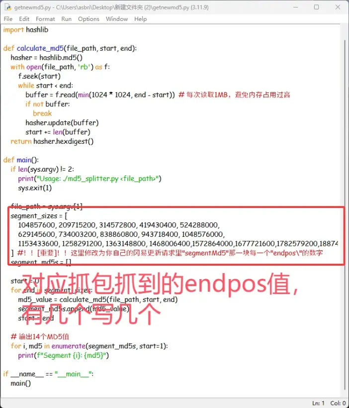

<details>
<summary>📋 操作说明（文字版）</summary>

打开工具包中的 `getnewmd5.py`，找到 `segment_sizes` 数组，将其中的值替换为你在第二步抓包返回值中 `segmentMd5` 字段里每一个分片的 `endpos` 数值，按顺序填入，数量与抓包结果中的分片数一致（不同设备分片数不同）。这个数组告诉脚本如何将 img 文件切分成与服务器描述一致的分块，从而计算出每块的 MD5。

</details>

然后在 cmd 中执行：

```bash
python getnewmd5.py {修改后的img路径}
```

紧跟着执行：

```bash
certutil -hashfile {修改后的img路径} md5
```

随后会获得分片 MD5 和整体 MD5：

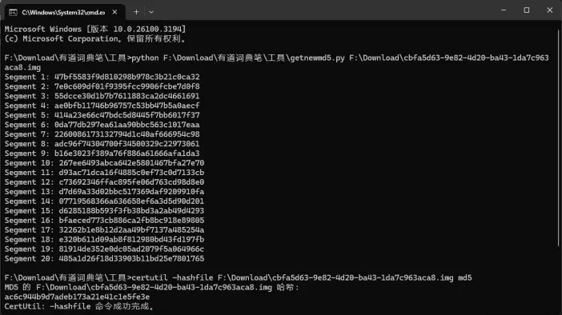

<details>
<summary>📋 操作说明（文字版）</summary>

在 cmd 中运行 `python getnewmd5.py {img路径}`，脚本会按 `segment_sizes` 中的分片边界逐段读取修改后的 img 并计算 MD5，输出形如 `Segment 1: xxx`、`Segment 2: xxx` 的结果，将这些分片 MD5 按顺序记录下来，后续填入 `YDPen.js` 的 `segmentMd5` 字段。接着运行 `certutil -hashfile {img路径} md5` 获得整个 img 文件的 MD5，记录为 `md5sum` 的替换值。

</details>

还需要计算 img 的 SHA256 值（可以使用 7-Zip），得到修改后的 img 的 SHA256 值，留存备用：

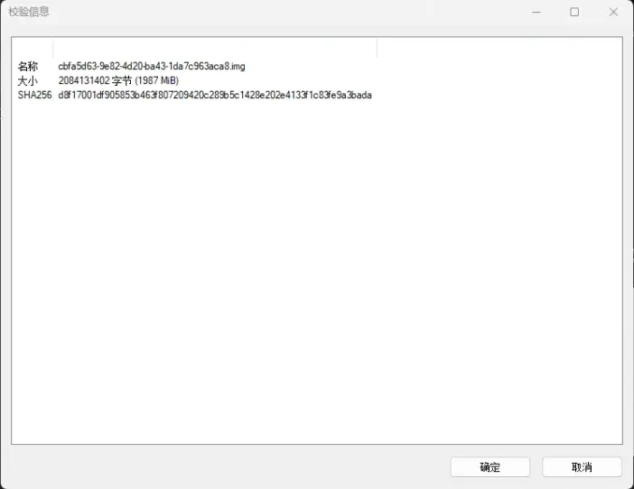

<details>
<summary>📋 操作说明（文字版）</summary>

用 7-Zip 右键点击修改后的 img 文件，选择"属性"或"CRC SHA → SHA-256"，等待计算完成后复制 SHA256 值，用于替换 `YDPen.js` 中的 `sha` 字段。注意此处计算的是修改过哈希值之后的 img，而非原始固件，务必在替换完哈希值并保存后再计算。

</details>

### 第六步：搭建更新服务器

首先自行安装 Node.js，然后编辑 `YDPen.js`：

1. 将 `JsonData` 的内容全部替换为前面抓包抓到的内容；
2. 手动修改 `segmentMd5` 中每一个分块的 MD5 值为前面计算得到的值；
3. 修改 `bakUrl` 和 `deltaUrl` 为 `http://{本机局域网ip}:14514/你修改的完整包.img`；
4. 修改 `md5sum` 为前面计算的完整 img 的 MD5；
5. 修改 `sha` 为计算的 SHA256 值；

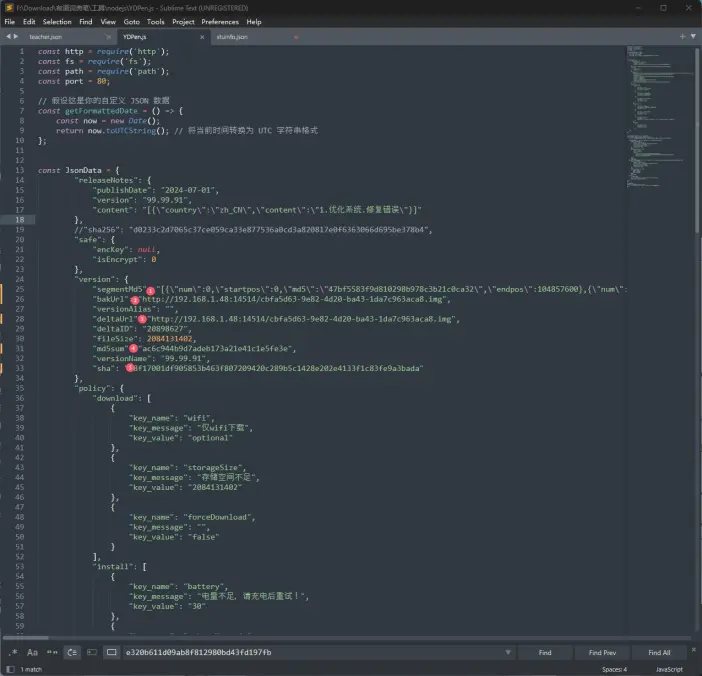

<details>
<summary>📋 操作说明（文字版）</summary>

用文本编辑器打开 `YDPen.js`，找到 `const JsonData = { ... }` 块，按以下方式逐项替换：将 `segmentMd5` 数组中每个分片对象的 `md5` 字段替换为第五步脚本输出的对应分段 MD5；将 `bakUrl` 和 `deltaUrl` 都改为 `http://{本机局域网IP}:14514/{你的img文件名}.img`（让词典笔从本机下载修改后的固件）；将 `md5sum` 改为整体 img 的 MD5；将 `sha` 改为整体 img 的 SHA256；`fileSize` 改为修改后 img 的字节数（由于只替换了哈希字符串，文件大小应与原始一致）。

</details>

6. 下拉到 js 下方部分，修改 `/product/1717746496/*********/ota/checkVersion` 为你自己抓到的请求 URL。

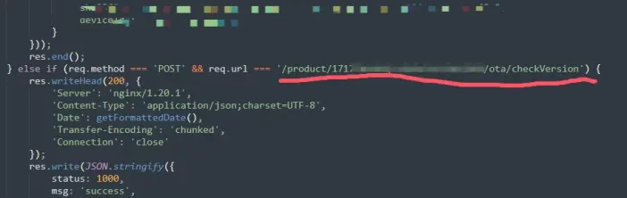

<details>
<summary>📋 操作说明（文字版）</summary>

在 `YDPen.js` 靠下的路由判断部分，找到形如 `req.url === '/product/1717746496/.../ota/checkVersion'` 的条件语句，将其中的路径替换为你在第一步 Wireshark 中抓到的实际请求 URL 路径（不含域名，只保留 `/product/...` 部分）。这样服务器才能正确拦截词典笔发出的更新检查请求，并返回伪造的更新信息。

</details>

开启两个 cmd 窗口，同时修改 hosts 文件把 `iotapi.abupdate.com` 劫持到本机 IP，并刷新 DNS：

```bash
# 窗口1
python httpserver.py {img路径}

# 窗口2
node YDPen.js

# 刷新 DNS
ipconfig /flushdns
```

> 💡 **服务器已启动但词典笔没有发出请求？** 前文提到的"假检查更新"问题在这个阶段同样存在——词典笔界面看起来在检查，但实际上什么请求也没发，Node.js 日志里没有任何记录。如果遇到这种情况，同样先尝试**恢复出厂设置 → 激活联网 → 再重试**，或者多触发几次检查更新。

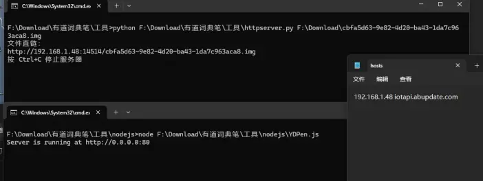

<details>
<summary>📋 操作说明（文字版）</summary>

开启第一个 cmd 窗口，运行 `python httpserver.py {img路径}`，这会在本机 14514 端口架设一个 HTTP 文件服务器，专门用于向词典笔提供修改后的固件文件；开启第二个 cmd 窗口，运行 `node YDPen.js`，启动伪装成有道更新服务器的 Node.js 服务（监听 80 端口）。然后以管理员权限编辑 `C:\Windows\System32\drivers\etc\hosts` 文件，添加一行 `{本机局域网IP} iotapi.abupdate.com`，将词典笔的更新请求劫持到本机。最后运行 `ipconfig /flushdns` 刷新 DNS 缓存使 hosts 生效。**词典笔和电脑必须处于同一局域网（连接同一热点）。**

</details>

### 第七步：更新自定义固件

在词典笔连接电脑热点的情况下检查更新，会检测到一个很大的更新包，直接更新即可：

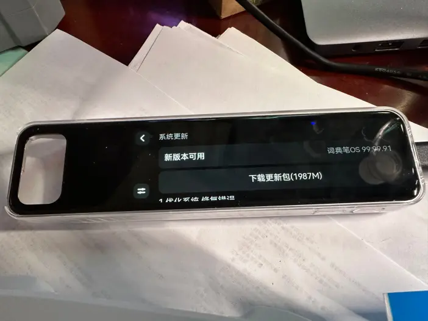

<details>
<summary>📋 操作说明（文字版）</summary>

确保词典笔连接到电脑热点、两个服务器均已启动、hosts 文件已修改并刷新 DNS 后，在词典笔上触发"检查更新"。词典笔会向被劫持的域名发出请求，Node.js 服务会返回伪造的更新信息（版本号 99.99.91，包大小与你的修改后 img 一致）。词典笔检测到"新版本可用"后会开始下载，下载完成后触发安装流程，等待设备自动重启完成刷机。

</details>

### 第八步：获得 ADB 权限，美美折腾

更新完毕后，待设备重启，再次去"法律监管"里面连击打开 ADB。此时连接电脑，执行：

```bash
adb shell auth
```

输入前面转换为 MD5 的密码明文，回车，见证奇迹！

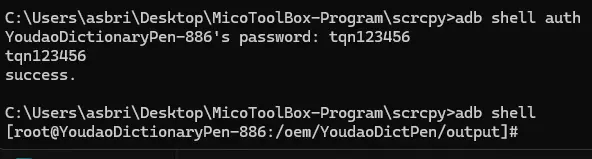

<details>
<summary>📋 操作说明（文字版）</summary>

设备重启后，进入"设置 → 法律监管"，连续点击文本多次打开 ADB 开关。用 USB 连接电脑，在 cmd 中运行 `adb shell auth`，出现密码提示后输入你在第四步设定的密码明文（即替换进 img 的那个密码，不是哈希值）。回车后若显示 `success.`，再次运行 `adb shell`，即可进入词典笔的 root shell（提示符为 `[root@YoudaoDictionaryPen-xxx:/...]#`）。至此 ADB 权限获取完成。

</details>

可以看到 ADB 连接成功，密码正确，并成功获得 shell 的 root 权限。

---

## 结语

至此，教程结束。

感谢各位大佬的支持，本文总结了多位大佬的经验，并加以修改，解决了一些很头疼的问题，比如那个恶心人的密码换行符以及 sed 修改不了 img 等。

如有疑问欢迎评论区讨论，谢谢大家！
